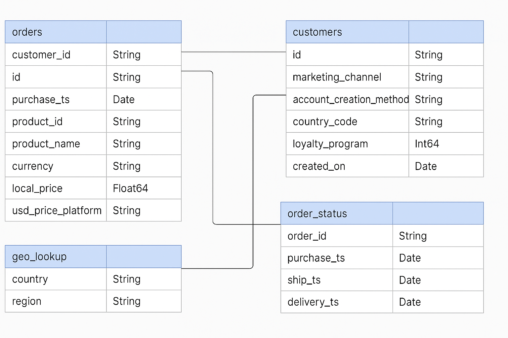

# Elist E-Commerce Analysis

## Project Overview
*Elist Electronics* is a global e-commerce company specializing in consumer electronics.  
This project delivers a comprehensive **business intelligence and analytics study** to uncover insights into sales trends, product performance, customer loyalty, and regional variations.

Using **SQL** for data extraction, cleaning, and transformation, and **Power BI** for visualization, the analysis transforms raw data into actionable insights that support strategic business decisions.

**Interactive Dashboard:** [Download Power BI (.pbix)](./EElectronics.pbix)

---

## Business Challenge  

After experiencing record sales during the pandemic, Elist Electronics saw a sharp decline in performance.  
This project answers key strategic questions:  

- What caused the post-pandemic revenue decline?  
- Which products drive the most value and which underperform?  
- How does the loyalty program impact customer spending and retention?  
- Which regions present the best opportunities for renewed growth?  

---

## Data Model & Structure  

The analysis used four primary tables:  

| Table | Description |
|-------|--------------|
| **orders** | Transactional order data (date, revenue, product ID, quantity) |
| **customers** | Customer details including loyalty status |
| **geo_lookup** | Regional and country mapping |
| **order_status** | Order fulfillment and refund tracking |

---

## Key Performance Indicators (KPIs)  

| KPI | Definition | Purpose |
|------|-------------|----------|
| **Revenue** | Total order value | Measures sales performance |
| **Orders** | Number of completed purchases | Tracks demand volume |
| **Average Order Value (AOV)** | Revenue ÷ Orders | Indicates purchasing behavior |
| **Member Revenue Share** | % of revenue from loyalty members | Evaluates customer retention success |
| **Refund Rate** | Refunded orders ÷ Total orders | Measures product/service issues |

---

## Executive Summary  

After a detailed analysis of Elist’s historical data, several key trends and insights emerged across **sales performance, product mix, loyalty impact, and regional differences**.  

These findings uncover both **risks** (overreliance on a narrow product base, declining non-member engagement) and **opportunities** (loyalty-driven growth, regional expansion, product diversification).

---

### Sales Trends  

Elist’s sales peaked in **December 2020** with over **4,000 orders and $1.25M in monthly revenue**, driven by pandemic-related consumer demand for electronics.  
However, from **April 2021 to December 2022**, revenue declined for **21 consecutive months**, reaching a lifetime low of **$178K in October 2022**.  

- **Revenue dropped 46%**, **Orders fell 40%**, and **AOV declined 10%** from peak values.  
- Despite the decline, **2022 full-year performance still exceeded 2019 levels**, reflecting the brand’s residual customer base strength.  
- The pattern highlights the importance of **long-term retention and diversification**, rather than dependence on exceptional global events.  

---

### Product Performance  

The analysis revealed **extreme product concentration** across Elist’s portfolio:  
- **85% of all orders** and **70% of revenue** come from **just three products** — mainly Apple accessories and gaming monitors.  
- **Apple AirPods Headphones** consistently outperform, while **Bose SoundSport Headphones** contribute less than 1% of total revenue despite being cheaper.  
- The **accessory category** grew from **21% of orders in 2020 to 32% in 2022**, but still represents only **4% of total revenue**, suggesting high volume but low profitability.  
- **Apple products account for 47% of 2022 revenue**, making Elist heavily dependent on a single brand ecosystem.  

**Interpretation:**  
Elist faces a **portfolio concentration risk** that limits resilience. Diversification—especially expanding mid-range accessories and non-Apple product lines—could unlock sustainable growth.  

---

### Loyalty Program Performance  

Introduced in 2019, the **loyalty program has become a key revenue driver**:  
- Loyalty member revenue share increased from **8% in 2019** to **55% in 2022**.  
- Members spend **$35 more per order** than non-members (**$251 vs $216 AOV**).  
- Member AOV **rose 1.1% YoY**, while non-member AOV **fell 18.7%** in 2022.  
- On repeat purchases, **loyalty members outspent non-members by nearly $60 per order**.  

**Interpretation:**  
The loyalty program effectively drives higher-value engagement and repeat purchasing. It has also acted as a **stabilizer** during periods of declining overall sales. Scaling the program further can reinforce customer retention and reduce revenue volatility.  

---

### Regional Comparisons  

Regional performance analysis highlighted **market imbalances and emerging opportunities**:  
- **North America** led in both revenue share (55%) and AOV ($242), 39% above **Latin America**, the lowest-performing region.  
- **EMEA** increased order share from **26% to 33%** in Q4 2022, signaling renewed activity.  
- All regions experienced sales decline post-2020, but North America maintained the **highest value per order**, while other regions grew in volume share.  

**Interpretation:**  
Elist’s performance remains **regionally uneven**, suggesting potential for targeted regional strategies — particularly leveraging EMEA’s growth momentum and addressing Latin America’s low AOV with more affordable bundles or promotions.  

---

### Recommendations  

Based on the analysis, several strategic recommendations were developed:  

1. **Diversify the Product Portfolio**  
   - With 85% of orders coming from three products, Elist must broaden its range to reduce risk.  
   - Focus on **high-margin accessories** and **new complementary categories** (e.g., chargers, smart devices).  

2. **Capitalize on Apple Ecosystem Loyalty**  
   - Apple products remain dominant; Elist should target **cross-sell campaigns** to existing Apple customers (e.g., AirPods + charging bundles).  

3. **Boost Samsung and Non-Apple Lines**  
   - Leverage the growing accessory demand to **introduce premium Samsung devices**, expanding beyond Apple dependency.  

4. **Enhance and Promote the Loyalty Program**  
   - Offer **sign-up discounts** and **personalized promotions** using purchase history data.  
   - Create targeted retention campaigns focusing on customers whose products are nearing replacement cycles.  

5. **Phase Out Underperforming Products**  
   - For low performers like Bose SoundSport, use **bundle offers, flash discounts**, or **inventory clearance** to reduce stock and test elasticity.  

6. **Regional Optimization**  
   - Localize marketing and pricing for **Latin America** to improve AOV.  
   - Increase marketing investment in **EMEA**, where recent volume growth suggests renewed interest.  

---

## Deliverables  

- [SQL: Data Quality Checks](./SQL/Initial%20Data%20Checks.sql) 
- [SQL: Data Cleaning & Preparation](./SQL/Data%20Cleaning.sql)
- [SQL: Targeted Business Questions](./SQL/Strategic%20Business%20Questions.sql)  
- [Power BI Dashboard (.pbix)](./EElectronics.pbix)

---

## Tools & Techniques  

| Tool | Purpose |
|------|----------|
| **SQL (PostgreSQL)** | Data extraction, cleaning, and transformation |
| **Power BI** | Visualization, dashboard design, and KPI reporting |
| **Excel** | Data validation and exports |
| **GitHub** | Version control and professional project showcase |

---
